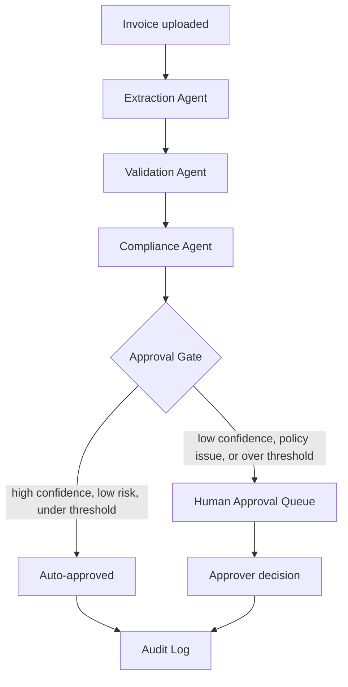

# Veriflow — AI-Powered Accounts Payable & Compliance Platform

Veriflow ingests vendor invoices, extracts structured data with an LLM, cross-checks it against internal vendor/PO records, evaluates it against company policy using retrieval-augmented generation, and routes each invoice to either automatic approval or a human review queue — with every decision logged for audit.

Built as a portfolio project to demonstrate production-oriented AI engineering: not a chatbot, not a RAG demo, but a governed multi-agent decision pipeline.

## Architecture



- **Extraction Agent** — pulls structured fields from the invoice PDF (Groq / GPT-OSS-20B), scored per-field with a multi-signal confidence system: deterministic cross-checks against the raw text, self-consistency across two independent LLM calls, and structured-output validation.
- **Validation Agent** — deterministic, no LLM call. Cross-references extracted vendor and PO data against internal Postgres records.
- **Compliance Agent** — retrieves relevant policy text via hybrid (dense + sparse) search with reranking, then reasons over those excerpts to judge policy compliance and required approval level, with citations.
- **Approval Gate** — deterministic rule combining validation, compliance, and confidence signals against an amount threshold; routes to auto-approval or a human queue.
- **Orchestration** — a LangGraph state graph, not a free-form agent conversation. Every transition is explicit and logged, which matters for a system making decisions that need to be auditable after the fact.

## Tech stack

| Layer | Choice |
|---|---|
| API | FastAPI, async where it matters |
| Database | PostgreSQL + SQLAlchemy 2.0 + Alembic |
| Vector store | Qdrant — native hybrid dense/sparse search |
| Embeddings & reranking | FastEmbed (BAAI/bge-base-en-v1.5, Qdrant/bm25, local cross-encoder reranker) |
| LLM | Groq (GPT-OSS-20B) |
| Agent orchestration | LangGraph |
| Auth | JWT + RBAC (Admin / Approver / Clerk / Auditor) |
| Testing | Pytest, mocked LLM/vector calls for CI, real end-to-end runs for verification |
| Eval | Custom golden-dataset harness, versioned by prompt |

## Setup

```bash
uv sync
cp .env.example .env   # fill in JWT_SECRET_KEY and GROQ_API_KEY
docker compose up -d db qdrant
uv run alembic upgrade head
uv run python -m app.scripts.create_admin admin@veriflow.dev yourpassword
uv run uvicorn app.main:app --reload
```
Visit `/docs` for the interactive API, `/health` to confirm database and vector store connectivity.

Run the test suite: `uv run pytest -q`
Run the eval harness (calls the real LLM, small cost): `uv run python -m app.eval.runner`

## Design decisions worth knowing about

**A deterministic state graph, not a conversational multi-agent system.** Extraction, validation, and compliance are separate LangGraph nodes with explicit, logged transitions — not agents "discussing" a decision. In a domain where every automated decision needs to be reconstructable after the fact, knowing exactly what happened and why at each step is a requirement, not a preference.

**Qdrant over pgvector.** Hybrid retrieval (dense + sparse, fused with RRF) is a core feature here, not an afterthought — Qdrant supports it natively. `pgvector` would have meant one fewer service to run, but hand-assembling BM25 and fusion logic ourselves for a feature we specifically wanted to showcase well wasn't the right trade here.

**Confidence scoring instead of chasing 100% extraction accuracy.** No LLM — regardless of provider or cost — is deterministic at nonzero temperature. Rather than trying to eliminate that, the system runs extraction twice and only trusts a field when both runs agree, with a deterministic cross-check against the source text as a second signal. The eval harness caught this directly: the same document, same prompt, correctly returned `null` for a missing due date on one run and hallucinated a date on another. That's the system working as designed — the confidence score on that field drops, and low-confidence fields route to a human instead of being silently trusted.

**Validation has no LLM call at all.** Comparing extracted data against a database record is deterministic logic. Routing it through an LLM would be slower, costlier, and less reliable than a direct comparison — not more sophisticated.

## Known limitations

- Invoice extraction only (no purchase orders, contracts, or line items yet)
- Text-layer PDFs only — no OCR for scanned documents
- Synchronous pipeline — fine at current volume, would need an async job queue before high-volume production use
- Eval harness currently measures single-call extraction accuracy rather than the self-consistency-protected path actually used in production
- No MCP tool-calling layer yet (planned, not built) — internal agents currently call service functions directly
